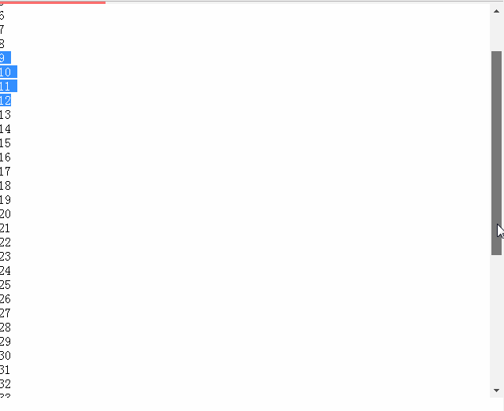

## hDProcess.js

### 介绍

以进度条的方式显示文档内容浏览进度的一款js插件。

### 兼容性

>Chrome 3+         
Firefox 2+        
Safari 3.2+       
Opera 10+         
IE 7+           

### 展示



### 用法

##### html

```
    <div id="container"></div>    
```

##### js

```
    var a=hProcess({
        id:"container",//容器元素id
        goalId:"content"//内容元素id，用于获取内容文档的高度。
    }).fixIE7();
```

#### css

本插件默认没有css样式，你可以自己修改样式。类名 .innerEl 就是 显示的进度条，你可以自己修改颜色，至于大小，直接修改绑定的容器元素的大小即可，进度条自动继承容器元素的高度宽度。
```
    #container{
        width: 100%;
        height: 3px;
        background-color: #f7f7f7;
    }
    .innerEl{
        background-color: #fb6d6d;
        height: 100%;
        width: 100%;
    }
```

### API

##### moveTo(percent)

将进度条移动到指定位置,percent的值为0-1;

##### example

```javascrtipt
    var a=hProcess({
        id:"container",//容器元素id
        goalId:"content"//内容元素id，用于获取内容文档的高度。
    }).fixIE7();

    a.moveTo(0.5);//将进度条移动到50%位置
```

#### fixIE7()

用于兼容 ie7浏览器下的bug。需要兼容ie7时 调用。

###  具体可以参考  index.html


